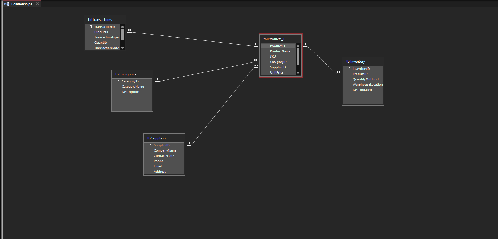
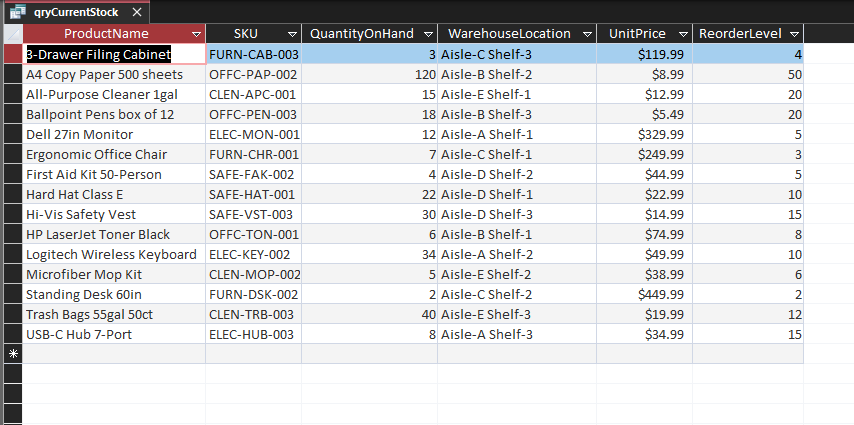
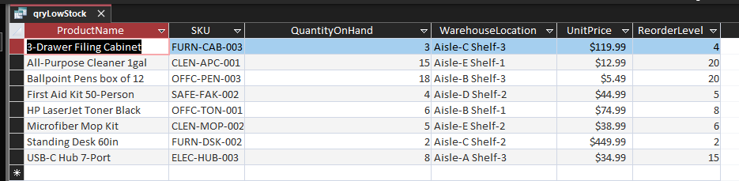
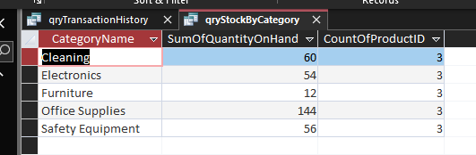
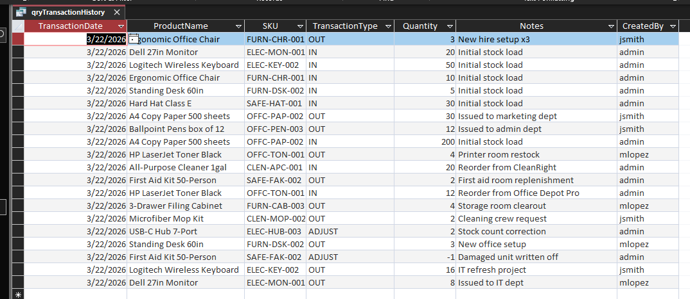

# inventory-control-sample-db

## Current Status: In Progress
- Tables with relationships - Completed
- Queries - Completed
- Forms - In progress
- Reports - In progress

## Features
Relational inventory management database built in Microsoft Access.
Tracks products, suppliers, stock levels and transactions.

## Database Structure
- **tblProducts** - product catalog with SKU, pricing, and reorder levels
- **tblCategories** - product category groupings
- **tblSuppliers** - supplier contact information
- **tblInventory** - current stock levels and warehouse locations
- **tblTransactions** - full audit log of stock movements (IN/OUT/ADJUST)

## Queries
- **qryCurrentStock** - stock levels joined across products and inventory
- **qryLowStock** - filters items at or below reorder level
- **qryTransactionHistory** - full audit of transactions with product names
- **qryStockByCategory** - summarized stock totals grouped by category

## Screenshots
 
### Relationships Diagram

 
### Current Stock Query

 
### Low Stock Alert Query

 
### Stock by Category Query

 
### Transaction History Query

## Requirements
Microsoft Access 2016 or later
